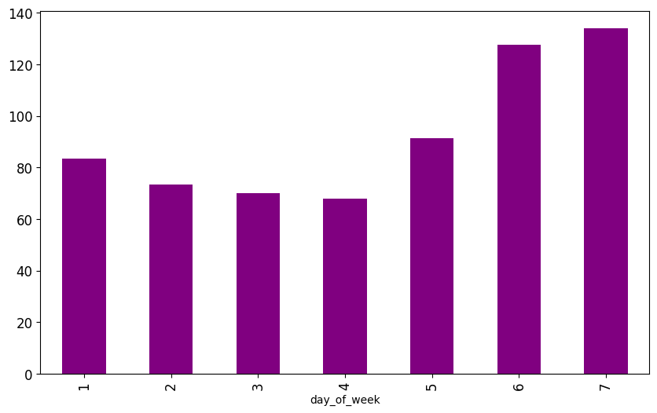
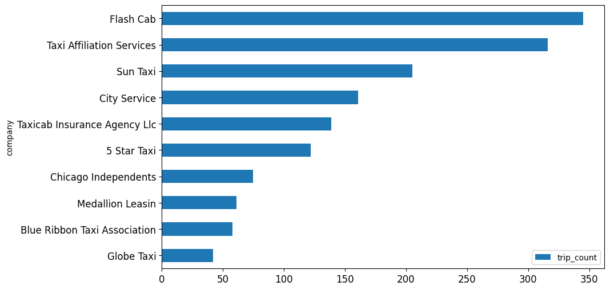
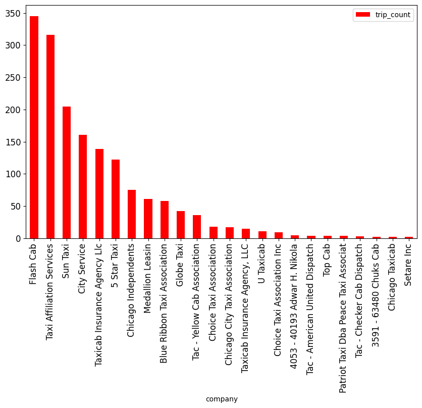
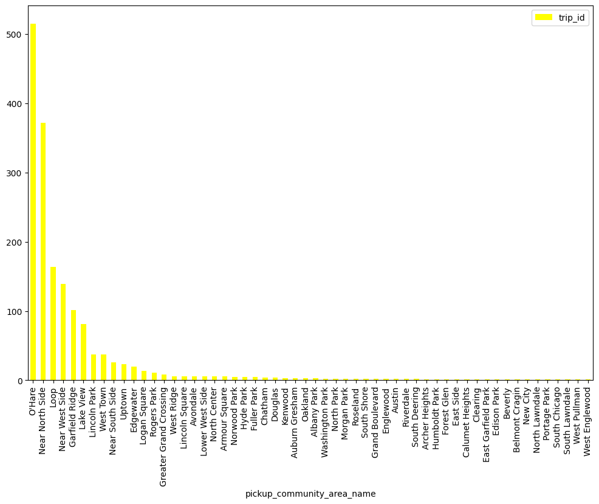
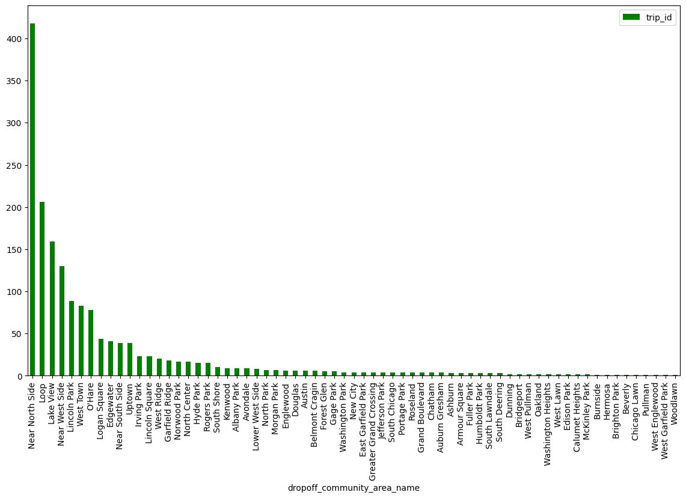

CUBIX Data Engineer Course Project

This project is part of the CUBIX Data Engineer course. The project contains several steps/elements that guide you through data processing, analysis and visualization techniques.

We will use Python 3.12.5 and Jupyter Notebook and elements of the AWS system, S3, Lambda, Athena.

Project: Taxi trips at Chicago

The sources of the data:

  Chicago Data Portal - https://data.cityofchicago.org/

  Open-Meteo - https://openweathermap.org/api

  Community areas in Chicago - https://en.wikipedia.org/wiki/Community_areas_in_Chicago

It retrieves taxi trip data from the Chicago Data Portal for a date two months ago, adds weather data, and performs custom transformations.
Add new payment types and companies to the main tables if they are not already present.

02_web_scraping - Retrieving City of Chicago public areas from Wikipedia using BeautifulSoup.

03_get_taxi_data - Query daily taxi data using API.

04_get_weather_data - Get weather data from the city of Chicago with API.

05_date_dimension - Preparing date columns for further use.

06_chicago_data_to_mapping - Get taxi travel data, convert JSON data to a Pandas DataFrame. 
        Drops columns with significant missing data, renames and converts columns, adds weather data,
        Extract custom payment types and companies to create master tables.

07_transform_load - Writing and testing functions locally in preparation for migration to the cloud and using these functions in AWS - Lambda service.
        Extracts unique company names from taxi route data and creates a master table with company IDs. Checks for new companies in an incoming dataset and adds them to the main company table. Handles changes to the payment type's main table updates.

08_local_visualisations - Retrieve data from AWS S3 storage after transformation and display the processed data.

Charts:

